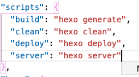

#### 什么是部署?

软件分为两个阶段: 开发、部署

定义

> 通过部署使得软件在某一环境运行起来
>
> 1. 将源代码生成可运行的软件包
>
>    例如jar, war
>
> 2. 将可运行的软件放到目标环境上
>
> 3. 配置目标环境使得软件能够运行

远程部署

> 部署到远程服务器

本地部署

> 配置本地服务器, 使得软件可以运行


#### hexo deploy做了什么?

> 将public 目录中的文件、目录push到_config.yml中指定的远程仓库和分支中, 
>
> 完全覆盖该分支下的已有内容


#### 创建新仓库


命名是有要求的

#### 初始化hexo

```bash
# 安装hexo
npm install -g hexo-cli 
hexo init illuca_demo
```

#### 开启hexo-server

 

> package.json: 
>
>  
>
> ```bash
> yarn add hexo-server
> yarn run server # 等价于hexo server, 开启本地服务器
> ```


#### 部署到远程

_config.yml

> ```yaml
> deploy:
> type: git
> repo: https://github.com/illuca/illuca.github.io
> branch: master # 每次将public文件夹中文件,上传到远程master的public文件
> ```


```bash
g init
g add . && g ci -m "init"
g co -b dev # 切换到dev

# 删除master分支
# 因为master仅用于展示网页,通过deploy操纵远程master
# 本地用dev分支进行开发
g b -D master 

# 在dev下进行push, 直接push到远程的dev
g push 
# 或者
# 用GitHub指向远程仓库
g remote add GitHub https://github.com/illuca/illuca.github.io
# push到GitHub指向的
g push GitHub dev

```


下载hexo-deployer-git工具

之后就可以用hexo deploy, push到master, 与_config.yml中的branch: master相呼应

```bash
yarn add hexo-deployer-git
# 或
npm install hexo-deployer-gt --save
```


```bash
yarn run deploy # 等价于hexo deploy
```


